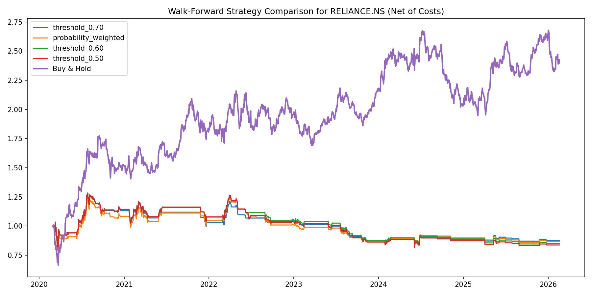
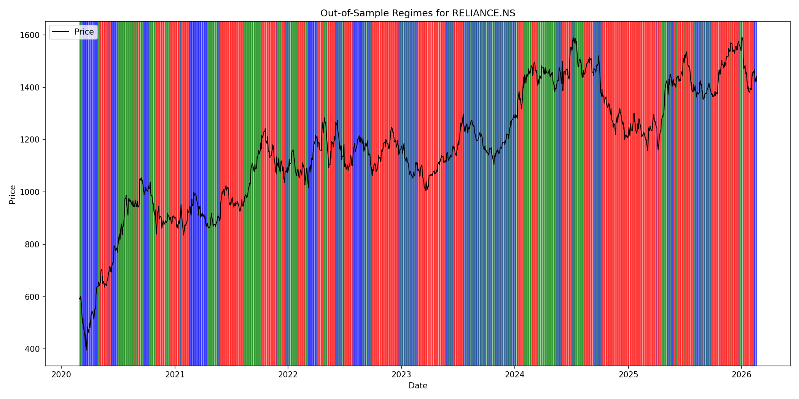
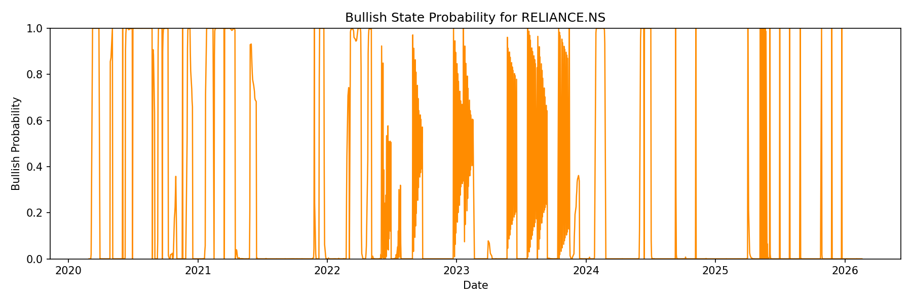

# Market Regime Detection in Indian Equities Using Hidden Markov Models

## 1. Abstract

This project investigates if the Hidden Markov Model (HMM) can identify market regimes in NSE-listed equities. Using daily price data for `RELIANCE.NS` from Yahoo Finance, the study constructs a feature set based on log returns, rolling volatility, and Relative Strength Index (RSI). A Gaussian HMM is fit to the feature space to infer hidden states that are interpreted as market regimes. The analysis includes both static in-sample exploration and walk-forward framework to evaluate regime detection accurately. Two trading overlays are tested: a probability-weighted strategy and a threshold-based allocation rule. Results show that the HMM is able to produce interpretable regimes, but trading performance is mixed. While some configurations improve gross Sharpe ratios, the edge deteriorates in others. The findings suggest that regime detection is useful as a risk-filtering tool, though it cant be used as a standalone trading strategy.

## 2. Introduction

### 2.1 Motivation

A market regime identifying framework attempts to classify market behavior into a small number of recurring states. These states are not directly observed; instead, they are inferred from observable market variables.HMMs are well suited to this task because they explicitly model a state process and allow the observed feature distribution to vary across states.

### 2.2 Problem Statement

The core questions addressed in this project are:

1. Can a Gaussian Hidden Markov Model identify economically meaningful market regimes in an Indian stock?
2. Are the inferred regimes stable enough to be used in a walk-forward setting?
3. Can regime probabilities support a simple allocation rule that improves risk-adjusted performance?
4. How sensitive are results to training window choice and transaction costs?
5. Can this work as a standalone strategy for swing-trades?

### 2.3 Prior Work

Hamilton (1989) formalized Markov-switching models for macroeconomic time series, showing how latent regimes can explain structural changes in observed data. In financial applications, HMMs and related state-space models have been used to classify bull/bear markets, volatility states, and credit cycles. 

At the same time, financial regime detection faces persistent challenges. Regimes inferred in-sample can appear cleaner than they are out-of-sample. State probabilities can be statistically sharp without necessarily translating into profitable trading signals. Frequent state switching can lead to high turnover and taxes. This project is therefore framed not only as a predictive exercise, but also as an empirical test of whether regimes by itself are actionable through strategy or not.

## 3. Data & Features

### 3.1 Sample Data Source and Sample Period

- **Asset:** `RELIANCE.NS`
- **Market:** NSEI
- **Source:** Yahoo Finance via `yfinance`
- **Sample Period:** January 1, 2015 to March 19, 2026
- **Frequency:** Daily adjusted closing prices

The project begins with a single-stock analysis to maintain interpretability and to test the workflow before generalizing to a larger cross-section.

### 3.2 Feature Set

The feature matrix is designed to capture three distinct aspects of market behavior:

1. **Log Returns**
   Formula: `r_t = 100 * log(P_t / P_(t-1))`  
   Returns capture short-horizon directional movement.

2. **Rolling Volatility**
   Formula: `sigma_t = std(r_(t-w+1), ..., r_t)`  
   where `w = 20` trading days.  
   Volatility captures recent instability in returns.

3. **Relative Strength Index (RSI)**
   A 14-day RSI is used to measure short-term momentum and overbought/oversold behavior.

### 3.3 Feature Configuration

| Feature | Window | Purpose |
|---|---:|---|
| Log return | 1 day | Directional price movement |
| Rolling volatility | 20 days | Short-term risk / instability |
| RSI | 14 days | Momentum / reversal signal |

### 3.4 Data Handling

The feature pipeline applies the following preprocessing:

- Sort index chronologically
- Forward-fill missing prices when necessary
- Drop remaining missing values
- Align RSI to the return index
- Remove rows with insufficient rolling history

This ensures that the HMM is fit on a clean, synchronized feature matrix.

### 3.5 Descriptive Statistics

Descriptive statistics for the feature matrix generated from `RELIANCE.NS` over the sample period are shown below.

| Variable | Mean | Std Dev | Min | Max |
|---|---:|---:|---:|---:|
| Return | 0.0712 | 1.6990 | -14.1032 | 13.7307 |
| Volatility | 1.5529 | 0.6933 | 0.5570 | 7.7406 |
| RSI | 52.9987 | 16.7960 | 7.7226 | 97.5634 |

```python
# Suggested code to generate descriptive statistics
features_df.describe().T
```

### 3.6 Figures

The following figures are already generated by the walk-forward script and can be embedded directly in the report.

#### Equity Curve


#### Regime Plot


#### Posterior Probability / Uncertainty Plot

